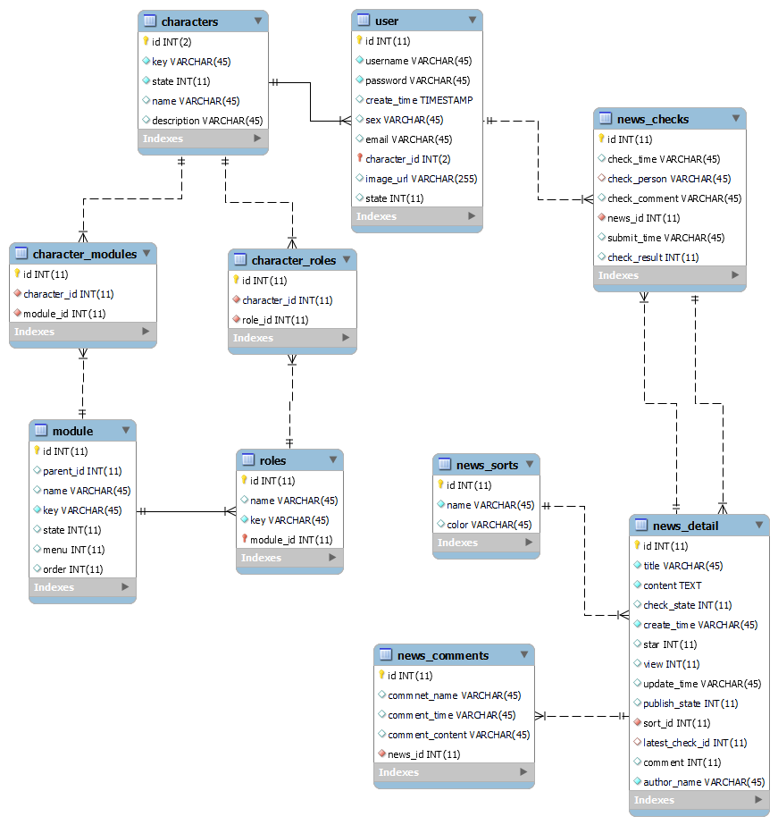
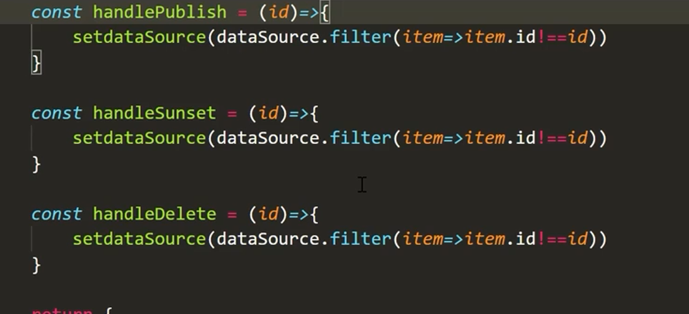

# news-system
## 文件结构
- news-app：前端
    ```
    npm i
    npm start
    ```
    > 还需要在node_modules里面配置一下别名  
- news-api：后端
    ```
    npm i
    node app.js
    ```
- mydb：数据库
      


## 其他参考
- 富文本：https://github.com/sstur/react-rte
- mobx：https://mobx-react.js.org/observer-component

## 其他乱七八糟

  
  
  
  

